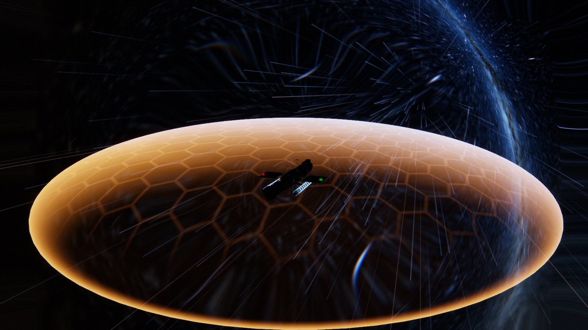
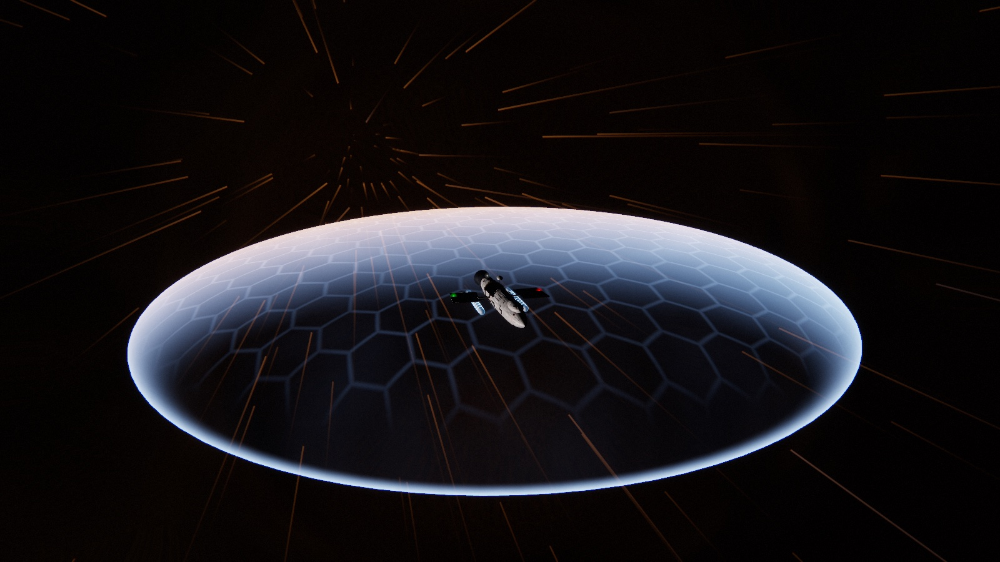
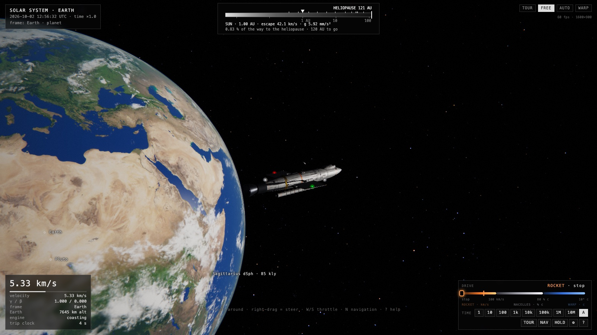
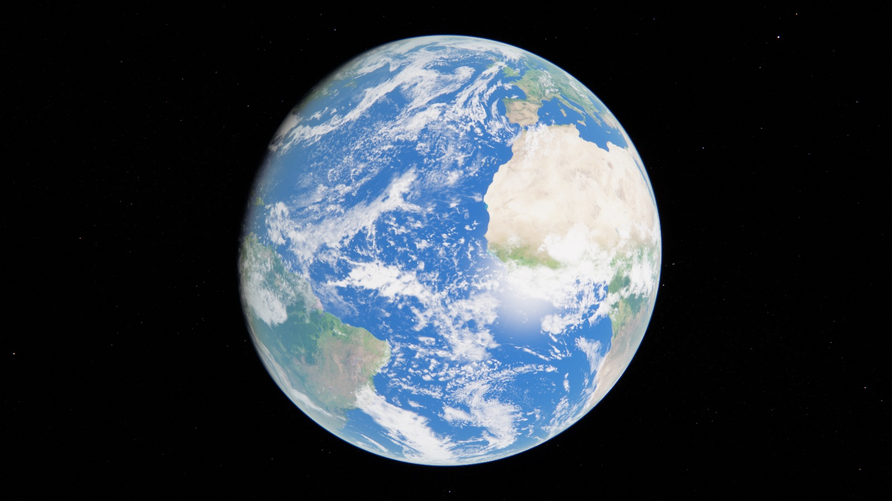

# 🚀 Starship

**Fly a little starship from Earth to the nearest stars, right in your browser.**
No install, no internet, no server. Open `index.html` and you're in space.

## What is this?

A toy universe you can leave running on a spare monitor, or take the controls of and wander.

- 🌍 The real Solar System, with the planets and moons where they actually are today
- ⭐ More than 100,000 real stars from the Gaia and Hipparcos catalogues, in their true places and colours
- 🌌 A Milky Way painted from real star-count data, and the nearest galaxies as faint smudges
- 🪐 Pick Alpha Centauri, Sirius, Barnard's Star, Proxima... and go there. Stars with no known planets get invented ones, clearly labelled *fictional*
- 🛰️ Slip into a quiet orbit around anything and just watch the world turn

## Three engines

| | |
|---|---|
| 🔥 **Rocket** | For gentle, close-in flying. A proper flame out the back. |
| ⚪ **Cruise nacelles** | For sailing between planets. The two nacelles glow soft white as they spool up. |
| 🔵 **Warp** | Out past the edge of the Sun's reach, the nacelles thrum blue and the ship rides a flat bubble of bent space. Ten light-years takes about five minutes at full tilt. |

One slider runs all three: orange for rocket, white for cruise, blue for warp.

## Try it

1. Open **`index.html`** in a modern browser (Chrome, Edge, Brave, Firefox or Safari).
2. Sit back. A tour of the Solar System starts by itself. There is also a tour of the nearby stars (the **STARS** button), and each tour can run **FAST** (time speeds up automatically) or **SLOW** (you pick the speed).
3. Press **T** to take the helm, **N** to pick somewhere to go, **P** to let the autopilot fly.

When time is racing, a little clock dial in the corner spins up to show it.

Tip: it makes a good wallpaper. Press **H** to hide the interface and leave it on tour.

| Key | What it does |
|---|---|
| `N` | Choose a destination (you can search by name) |
| `P` | Autopilot on / off |
| `G` | Warp on / off |
| `W` `S` | Faster / slower |
| mouse drag | Look around the ship; scroll to zoom |
| `H` | Hide the interface |
| `?` | Full help |

## Good to know

- It's a toy, not a flight manual. The planets, stars and orbits are real; the ship, the warp bubble and the engines are made up.
- Everything lives in this folder and works offline.
- Settings live in `config.js` and in the in-app settings panel (`,`).

The nerdy details (data sources, how it's built, how to rebuild the star data) are in [`docs/DETAILS.md`](docs/DETAILS.md).

## Credits

Star data from ESA's Hipparcos and Gaia missions, planets and moons from NASA/JPL, exoplanets from the NASA Exoplanet Archive, planet textures from Solar System Scope (CC BY 4.0), rendered with [three.js](https://threejs.org).
